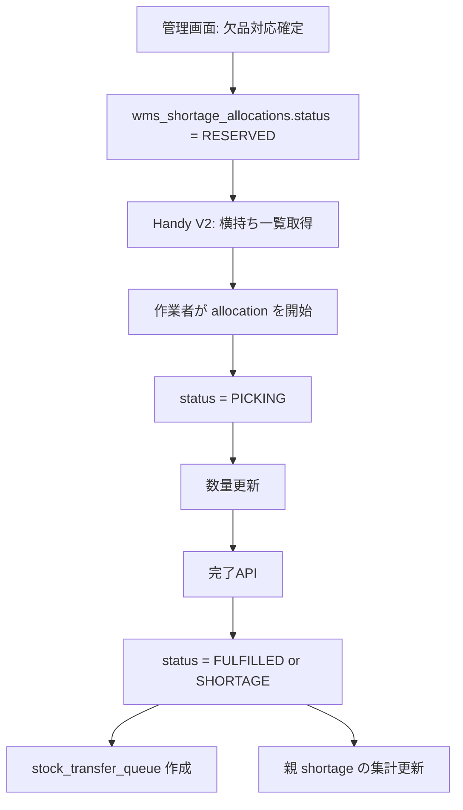

# 横持ち出荷 Android API / Handy V2 開発設計書

- 作成日: 2026-04-18
- 対象: 横持ち出荷のAndroidアプリ対応、およびWeb上のAPI試験環境整備
- 関連仕様:
  - `storage/specifications/20260418/shipping-and-proxy-shipment-spec.md`
  - `storage/specifications/20260310/20260310-outbound-logic-specification/20260310-outbound-logic-specification.md`
  - `storage/specifications/old/2025-10-13-wms-specification.md`
  - `storage/specifications/knowledges/filament4spec.md`

## 1. 背景と目的

横持ち出荷は、通常のWave出荷とは異なり、欠品発生後に管理画面から他倉庫への代理出荷を指示し、出荷元倉庫で追加ピッキングを行う業務である。

現状は以下までは実装済み:

1. 通常ピッキング完了時に欠品を検出して `wms_shortages` を作成する
2. 管理画面で `wms_shortage_allocations` を作成する
3. 欠品対応確定時に `wms_shortage_allocations.is_confirmed = true` にする

未実装なのは、確定済み横持ち出荷を倉庫作業者がAndroidアプリから取得し、倉庫別・日付別・配送コース別にピッキングし、完了時に `stock_transfer_queue` へ連携する部分である。

今回の目的は、実装そのものではなく、上記を実現するための開発設計を確定し、同時にブラウザ上でAPIを試験できる Handy V2 の追加方針まで明文化することにある。

## 2. 現行業務の整理

### 2.1 横持ち出荷の業務位置づけ

横持ち出荷は次の流れで発生する。

```text
通常出荷ピッキング
  -> 欠品検出
  -> wms_shortages 作成
  -> 管理者が代理出荷倉庫を指定
  -> wms_shortage_allocations 作成
  -> 欠品対応確定
  -> ここから先のモバイルピッキング手段が未整備
```

### 2.2 通常出荷との違い

| 項目 | 通常出荷 | 横持ち出荷 |
| --- | --- | --- |
| 元データ | `wms_picking_tasks`, `wms_picking_item_results` | `wms_shortage_allocations` |
| 発生契機 | Wave生成 | 欠品確定後の管理者指示 |
| 取得タイミング | Wave生成後のみ | 常時取得 |
| ピッキング単位 | タスク配下の複数明細 | allocation 1件 = 1商品1指示 |
| 完了後の後処理 | `earning_delivery_queue` 登録 | `stock_transfer_queue` 登録 |

### 2.3 現行コードから読み取れる重要事項

1. `ConfirmShortageAllocations` は確定時に allocation のステータスを `PENDING` ではなく `RESERVED` に更新する
2. したがって、モバイルアプリの公開対象は `PENDING` ではなく `RESERVED` / `PICKING` である
3. `wms_shortage_allocations` には `picked_qty`, `is_finished`, `finished_at` はあるが、モバイル作業開始を明示する `started_at` はない
4. `StockTransferQueueService` は現状 idempotent ではなく、同一 allocation の完了再送で重複キューを作りうる
5. 横持ち出荷は Wave に乗らないため、`PickingTaskController` を再利用すると責務がねじれる

## 3. 今回の開発範囲

### 3.1 スコープ

1. 横持ち出荷専用APIの新設
2. 横持ち出荷を倉庫別・日付別・配送コース別に取得できる一覧API
3. 横持ち出荷の開始・数量更新・完了API
4. Handy V2 に横持ちタブを追加し、ブラウザから直接APIを試験できるようにする
5. OpenAPI / 自動テスト / 手動試験手順の整備

### 3.2 今回のスコープ外

1. V1 Handy (`/handy/*`) への横持ち画面追加
2. 管理画面の欠品指示UIの全面改修
3. 横持ち出荷時の厳密な在庫予約テーブル新設
4. 横持ち出荷を Wave と同じルート最適化対象にする対応

## 4. 設計方針

### 4.1 専用APIとして切り出す

横持ち出荷は `wms_picking_tasks` を経由しないため、`PickingTaskController` へ混在させず、専用の `ProxyShipmentController` を新設する。

### 4.2 アプリ公開対象ステータスを明確化する

アプリで扱う allocation の条件は次で固定する。

```sql
WHERE is_confirmed = true
  AND is_finished = false
  AND status IN ('RESERVED', 'PICKING')
```

`PENDING` は管理画面上の確定前状態であり、アプリ公開対象に含めない。

### 4.3 クライアント向け項目名は業務語で返す

DBカラムの `target_warehouse_id` / `source_warehouse_id` は業務上直感的でないため、APIレスポンスでは以下の名称に変換する。

| DB | API |
| --- | --- |
| `target_warehouse_id` | `pickup_warehouse` |
| `source_warehouse_id` | `destination_warehouse` |

これにより、アプリ側は「どこから取って、どこへ送るか」を列名で誤解しない。

### 4.4 Handy V2 のみ対応する

Web上のAPI試験環境は既存の SPA である Handy V2 に追加する。理由は以下の通り。

1. API直叩き構成が既にある
2. 認証、倉庫選択、バーコード入力、通知表示を流用できる
3. 入荷と同じ「常時取得モデル」のため、実装パターンが近い

### 4.5 完了APIはべき等にする

Android端末では通信再送が起こりうるため、完了APIは再送しても二重で `stock_transfer_queue` を作らないことを必須条件とする。

### 4.6 位置情報は「候補ロケーション」として返す

横持ち出荷は現時点で出荷元倉庫側の予約を持っていないため、通常ピッキングのように単一 `real_stock_id` を固定できない。

そのため Phase 1 では、`wms_v_stock_available` をもとに FEFO/FIFO 順の候補ロケーション一覧を返す方式とし、厳密な予約連動は今後の拡張課題とする。

## 5. システム構成

### 5.1 バックエンド責務

| レイヤー | ファイル | 役割 |
| --- | --- | --- |
| Controller | `app/Http/Controllers/Api/ProxyShipmentController.php` | API入出力、バリデーション、レスポンス整形 |
| Query Service | `app/Services/Shortage/ProxyShipmentQueryService.php` | 一覧/詳細取得、候補ロケーション取得 |
| Command Service | `app/Services/Shortage/ProxyShipmentPickingService.php` | 開始・数量更新・完了・親 shortage 更新 |
| Existing Service | `app/Services/Shortage/StockTransferQueueService.php` | 完了時の移動伝票キュー作成。べき等化して流用 |

### 5.2 フロントエンド責務

| レイヤー | ファイル | 役割 |
| --- | --- | --- |
| Main App | `resources/js/handy-v2/app.js` | 画面遷移、タブ切替、通知連携 |
| Store | `resources/js/handy-v2/stores/proxy-shipment.js` | 一覧、フィルタ、作業中明細、結果保持 |
| Service | `resources/js/handy-v2/services/proxy-shipment-service.js` | 横持ちAPI呼び出し |
| View | `resources/views/handy-v2/partials/proxy-shipment/*.blade.php` | 一覧、ピッキング、結果画面 |

### 5.3 処理フロー



## 6. API詳細設計

### 6.1 エンドポイント一覧

| Method | Path | 説明 |
| --- | --- | --- |
| GET | `/api/proxy-shipments` | 横持ち出荷一覧取得 |
| GET | `/api/proxy-shipments/{id}` | 横持ち出荷詳細取得 |
| POST | `/api/proxy-shipments/{id}/start` | 横持ち出荷開始 |
| POST | `/api/proxy-shipments/{id}/update` | ピック数更新 |
| POST | `/api/proxy-shipments/{id}/complete` | 横持ち出荷完了 |

### 6.2 一覧API

#### リクエスト

```http
GET /api/proxy-shipments?warehouse_id=991&shipment_date=2026-04-18&delivery_course_id=100
```

| パラメータ | 必須 | 内容 |
| --- | --- | --- |
| `warehouse_id` | 必須 | 出荷元倉庫ID |
| `shipment_date` | 任意 | 出荷日。クライアントは初期表示時に必ず送る |
| `delivery_course_id` | 任意 | 配送コース絞り込み |

#### クエリ条件

```sql
SELECT sa.*
FROM wms_shortage_allocations sa
JOIN wms_shortages s ON s.id = sa.shortage_id
WHERE sa.is_confirmed = true
  AND sa.is_finished = false
  AND sa.status IN ('RESERVED', 'PICKING')
  AND sa.target_warehouse_id = :warehouse_id
  AND (:shipment_date IS NULL OR sa.shipment_date = :shipment_date)
  AND (:delivery_course_id IS NULL OR sa.delivery_course_id = :delivery_course_id)
ORDER BY sa.shipment_date ASC, sa.delivery_course_id ASC, sa.id ASC;
```

#### レスポンス方針

1. `data` は allocation の配列
2. `summary` に件数と配送コース別件数を含める
3. `meta.business_date` を返し、Handy V2 の初期日付に使う

#### レスポンス例

```json
{
  "is_success": true,
  "code": "SUCCESS",
  "result": {
    "data": [
      {
        "allocation_id": 123,
        "shortage_id": 456,
        "shipment_date": "2026-04-18",
        "status": "RESERVED",
        "pickup_warehouse": {
          "id": 992,
          "code": "2",
          "name": "酒丸蔵 第2倉庫"
        },
        "destination_warehouse": {
          "id": 991,
          "code": "1",
          "name": "酒丸蔵 本社"
        },
        "delivery_course": {
          "id": 100,
          "code": "910072",
          "name": "佐藤 尚紀"
        },
        "item": {
          "id": 100,
          "code": "111048",
          "name": "商品A",
          "jan_codes": ["4901234567890"],
          "volume": "720ml",
          "capacity_case": 12,
          "temperature_type": "常温",
          "images": []
        },
        "assign_qty": 10,
        "assign_qty_type": "CASE",
        "picked_qty": 0,
        "remaining_qty": 10,
        "customer": {
          "code": "C001",
          "name": "得意先A"
        },
        "slip_number": 789,
        "is_editable": true
      }
    ],
    "summary": {
      "total_count": 15,
      "by_delivery_course": [
        { "id": 100, "code": "910072", "name": "佐藤 尚紀", "count": 8 },
        { "id": 101, "code": "910073", "name": "田中 太郎", "count": 7 }
      ]
    },
    "meta": {
      "business_date": "2026-04-18"
    }
  }
}
```

### 6.3 詳細API

#### 目的

一覧では軽量情報のみ返し、作業画面で必要な候補ロケーション、欠品詳細を詳細APIで返す。

#### 候補ロケーション取得

`wms_v_stock_available` は `real_stock_lots` と結合しているため、`real_stock_id` 重複に注意する。候補ロケーションは `real_stock_id` を重複排除してから集計する。

```sql
SELECT
  x.location_id,
  CONCAT_WS('-', l.code1, l.code2, l.code3) AS location_code,
  SUM(available_for_wms) AS available_qty
FROM (
  SELECT DISTINCT
    v.real_stock_id,
    v.location_id,
    v.available_for_wms,
    v.expiration_date,
    v.created_at
  FROM wms_v_stock_available v
  WHERE v.warehouse_id = :pickup_warehouse_id
    AND v.item_id = :item_id
    AND v.available_for_wms > 0
) x
LEFT JOIN locations l ON l.id = x.location_id
GROUP BY x.location_id, l.code1, l.code2, l.code3
ORDER BY MIN(expiration_date) ASC, MIN(created_at) ASC, MIN(real_stock_id) ASC;
```

#### レスポンス追加項目

```json
{
  "shortage_detail": {
    "order_qty": 20,
    "planned_qty": 15,
    "picked_qty": 10,
    "shortage_qty": 10,
    "qty_type_at_order": "CASE"
  },
  "candidate_locations": [
    {
      "location_id": 1,
      "code": "A-01-02",
      "available_qty": 6
    },
    {
      "location_id": 2,
      "code": "A-02-01",
      "available_qty": 8
    }
  ]
}
```

### 6.4 開始API

#### 入力

`warehouse_id` は必須とし、allocation の `target_warehouse_id` と一致することを検証する。

#### 振る舞い

1. `RESERVED` -> `PICKING` に更新
2. `PICKING` の再送は成功扱いで現在状態を返す
3. `is_finished = true` または `status NOT IN (RESERVED, PICKING)` は 422

#### 備考

Phase 1 では `started_at` を永続化するため、allocation に `started_at` / `started_picker_id` を追加する。

### 6.5 数量更新API

#### リクエスト

```json
{
  "warehouse_id": 992,
  "picked_qty": 8
}
```

#### バリデーション

1. `picked_qty` は整数、`0 <= picked_qty <= assign_qty`
2. `status` は `RESERVED` または `PICKING`
3. `is_confirmed = true`, `is_finished = false`

#### 更新ルール

1. `RESERVED` への更新要求は暗黙的に `PICKING` に遷移させる
2. `picked_qty` のみ更新し、最終ステータス判定は complete で行う

### 6.6 完了API

#### リクエスト

`picked_qty` は任意。送られた場合は complete 内で最後の更新値として採用する。

```json
{
  "warehouse_id": 992,
  "picked_qty": 10
}
```

#### ステータス判定

| 条件 | allocation.status |
| --- | --- |
| `picked_qty >= assign_qty` | `FULFILLED` |
| `0 < picked_qty < assign_qty` | `SHORTAGE` |
| `picked_qty = 0` | `SHORTAGE` |

#### 後処理

1. `is_finished = true`
2. `finished_at = now()`
3. `finished_picker_id = request->user()->id`
4. `picked_qty > 0` の場合のみ `stock_transfer_queue` を作成
5. 関連 allocation 完了分の `picked_qty` 合計から親 shortage の集計状態を再計算

#### べき等性

1. 完了済み (`is_finished = true`) の再送は 200 を返す
2. `stock_transfer_queue.request_id` は `"proxy-shipment-{allocation_id}"` とする
3. complete 前に同 request_id のキューが存在する場合は新規作成せず既存IDを返す

#### トランザクション方針

`allocation` 更新と `stock_transfer_queue` 作成は同一トランザクションにまとめる。

- `picked_qty > 0` かつ queue 作成失敗: allocation 更新もロールバック
- `picked_qty = 0`: queue 不要のため正常完了

これは、通常出荷の `earning_delivery_queue` が「後続非同期」なのに対し、横持ち出荷では queue 作成そのものが業務完了条件だからである。

### 6.7 エラー方針

| ケース | HTTP | code |
| --- | --- | --- |
| allocation 不存在 | 404 | `NOT_FOUND` |
| 倉庫不一致 | 422 | `VALIDATION_ERROR` |
| 確定前 / 完了済み | 422 | `VALIDATION_ERROR` |
| `picked_qty > assign_qty` | 422 | `VALIDATION_ERROR` |
| queue 作成失敗 | 500 | `ERROR` |

## 7. データ設計

### 7.1 追加カラム

`wms_shortage_allocations` に以下を追加する。

| カラム | 型 | 用途 |
| --- | --- | --- |
| `started_at` | timestamp nullable | モバイル作業開始日時 |
| `started_picker_id` | unsignedBigInteger nullable | 作業開始した `wms_pickers.id` |
| `finished_picker_id` | unsignedBigInteger nullable | モバイル完了者の `wms_pickers.id` |

### 7.2 既存カラムの扱い

| カラム | 方針 |
| --- | --- |
| `finished_user_id` | 管理画面からの手動完了専用として維持 |
| `confirmed_user_id` | 管理者承認専用として維持 |
| `picked_qty` | Android / Handy V2 で更新する実績数量 |

`finished_user_id` は `users.id` 前提のため、Android 側の `WmsPicker` ID を格納しない。

### 7.3 モデル変更

`app/Models/WmsShortageAllocation.php` に以下を反映する。

1. `started_at`, `started_picker_id`, `finished_picker_id` を `fillable` / `casts` に追加
2. `startedPicker()`, `finishedPicker()` の relation を `WmsPicker` 向けに追加
3. `scopeReadyForProxyPicking()` を追加し、一覧対象条件を一箇所に閉じる

## 8. サービス設計

### 8.1 `ProxyShipmentQueryService`

想定メソッド:

```php
listForWarehouse(int $warehouseId, ?string $shipmentDate, ?int $deliveryCourseId): array
findForWarehouse(int $allocationId, int $warehouseId): WmsShortageAllocation
getCandidateLocations(WmsShortageAllocation $allocation): array
```

責務:

1. 一覧/詳細取得
2. item, jan, customer, warehouse, delivery course の整形
3. 候補ロケーションの FEFO/FIFO 順返却

### 8.2 `ProxyShipmentPickingService`

想定メソッド:

```php
start(WmsShortageAllocation $allocation, WmsPicker $picker): WmsShortageAllocation
update(WmsShortageAllocation $allocation, WmsPicker $picker, int $pickedQty): WmsShortageAllocation
complete(WmsShortageAllocation $allocation, WmsPicker $picker, ?int $pickedQty = null): array
```

責務:

1. ステータス遷移
2. `picked_qty` 更新
3. `stock_transfer_queue` 作成
4. 親 `wms_shortages` の集計反映

### 8.3 親 shortage の再計算ルール

`ProxyShipmentService::updateFulfillmentStatus()` は現状未使用かつ `assign_qty` ベースで集計しているため、モバイル完了時は以下ルールで再設計する。

1. 対象は `is_finished = true` の allocation
2. 集計値は `SUM(picked_qty)` を使用する
3. `sum(picked_qty) >= shortage.shortage_qty` のとき shortage は `SHORTAGE`
4. `0 < sum(picked_qty) < shortage.shortage_qty` のとき shortage は `PARTIAL_SHORTAGE`
5. `sum(picked_qty) = 0` のとき既存値を維持する

`SHORTAGE` は「欠品処理確定済み」の意味で維持し、新たな shortage ステータスは追加しない。

### 8.4 `StockTransferQueueService` 改修

最低限の改修点:

1. request_id を `"proxy-shipment-{allocation_id}"` に変更
2. 同 request_id の既存 queue を先に検索する
3. 既存 queue があればその ID を返す

## 9. Handy V2 画面設計

### 9.1 タブ構成

既存:

```text
入荷 | 出荷 | 設定
```

変更後:

```text
入荷 | 出荷 | 横持 | 設定
```

### 9.2 画面遷移

```text
PROXY_SHIPMENT_LIST
  -> PROXY_SHIPMENT_ITEM
  -> PROXY_SHIPMENT_RESULT
  -> PROXY_SHIPMENT_LIST
```

### 9.3 一覧画面

表示要素:

1. 出荷元倉庫: 画面上部に現在選択倉庫を表示
2. 日付フィルタ: 初期値は `meta.business_date`
3. 配送コースフィルタ: summary から生成
4. allocation カード一覧

カード表示項目:

1. 配送コース
2. 得意先
3. 商品CD / 商品名
4. 予定数 / 実績数 / 残数
5. ステータスバッジ

### 9.4 ピッキング画面

表示要素:

1. 商品画像
2. JANコード一覧
3. 数量入力
4. 候補ロケーション一覧
5. バーコード一致判定
6. 「更新」「完了」ボタン

### 9.5 結果画面

表示要素:

1. 完了メッセージ
2. 実績数
3. 作成された `stock_transfer_queue_id`（存在する場合）
4. 「一覧へ戻る」ボタン

### 9.6 追加ファイル

| ファイル | 役割 |
| --- | --- |
| `resources/js/handy-v2/stores/proxy-shipment.js` | 横持ち状態管理 |
| `resources/js/handy-v2/services/proxy-shipment-service.js` | API通信 |
| `resources/views/handy-v2/partials/proxy-shipment/list.blade.php` | 一覧 |
| `resources/views/handy-v2/partials/proxy-shipment/item.blade.php` | 作業画面 |
| `resources/views/handy-v2/partials/proxy-shipment/result.blade.php` | 結果 |

### 9.7 既存変更ファイル

| ファイル | 変更内容 |
| --- | --- |
| `resources/js/handy-v2/app.js` | タブ追加、画面遷移追加 |
| `resources/js/handy-v2/utils/constants.js` | `TABS` / `SCREENS` 追加 |
| `resources/views/handy-v2/app.blade.php` | 横持ちタブと画面差し込み |

## 10. テスト設計

### 10.1 自動テスト

新規:

| ファイル | 観点 |
| --- | --- |
| `tests/Feature/Api/ProxyShipmentApiTest.php` | 一覧、詳細、開始、更新、完了、認証、再送 |

最低限のケース:

1. `RESERVED` allocation が一覧に出る
2. `PENDING` allocation は一覧に出ない
3. start で `PICKING` に変わる
4. update で `picked_qty` が更新される
5. complete で `stock_transfer_queue` が1件だけ作られる
6. complete 再送で queue が増えない
7. `picked_qty > assign_qty` は 422

### 10.2 OpenAPI

1. `ProxyShipmentController` に OA annotation を付与
2. `storage/api-docs/api-docs.json` を再生成
3. Web上のAPI確認は Swagger と Handy V2 の両方で行う

### 10.3 手動試験

1. 管理画面で横持ち出荷を作成・確定
2. `/handy-v2/` にログイン
3. 倉庫選択
4. 横持ちタブで当日データ表示確認
5. 日付変更、配送コース絞り込み確認
6. 数量更新、完了、再送確認
7. `stock_transfer_queue.request_id = proxy-shipment-{allocation_id}` の重複防止確認

## 11. リスクと対策

| リスク | 内容 | 対策 |
| --- | --- | --- |
| 在庫競合 | 横持ち出荷元の在庫予約がないため、一覧表示後に在庫が減る可能性がある | Phase 1 は候補ロケーション提示に留め、完了時 shortage を許容する |
| 重複キュー | 端末再送で `stock_transfer_queue` が二重作成される | request_id でべき等化する |
| actor 型不一致 | `finished_user_id` に `WmsPicker` ID を入れると整合が崩れる | `finished_picker_id` を追加する |
| 責務混在 | 通常出荷APIへ横持ちロジックを混ぜると保守が破綻する | 専用 Controller / Service を切る |

## 12. 実装ステップ

| Step | 変更内容 | 検証方法 | ロールバック | リスク |
| --- | --- | --- | --- | --- |
| 1 | allocation 追加カラム migration / model 反映 | migration 後に一覧取得と更新確認 | 追加カラムを未使用化 | 低 |
| 2 | `ProxyShipmentController`, QueryService, PickingService 実装 | Feature test + curl | route を外す | 中 |
| 3 | `StockTransferQueueService` をべき等化 | complete 再送試験 | request_id 変更を戻す | 中 |
| 4 | `routes/api.php` と OA annotation 追加 | Swagger 表示確認 | route を外す | 低 |
| 5 | Handy V2 横持ちタブ追加 | `/handy-v2/` 手動試験 | タブを隠す | 中 |
| 6 | `ProxyShipmentApiTest` 追加 | `php artisan test --filter=ProxyShipmentApiTest` | テストファイル削除 | 低 |

## 13. 最終判断

今回の横持ち出荷対応は、通常出荷の派生ではなく、`wms_shortage_allocations` を中心にした独立した常時取得ワークフローとして扱う。

そのうえで実装は次の形に固定する。

1. APIは `/api/proxy-shipments/*` として独立させる
2. アプリ公開対象は `RESERVED` / `PICKING` の confirmed allocation のみ
3. 完了APIは必ずべき等にする
4. Web試験環境は Handy V2 に横持ちタブを追加して対応する
5. Phase 1 では予約連動までは行わず、候補ロケーション提示 + 完了時集計で成立させる

この設計で、ユーザー要求である「横持ち出荷の理解」「倉庫別・日付別・配送コース別のピッキング」「Web上でAPI試験可能なアプリ」の3点を最小の破壊範囲で満たせる。
